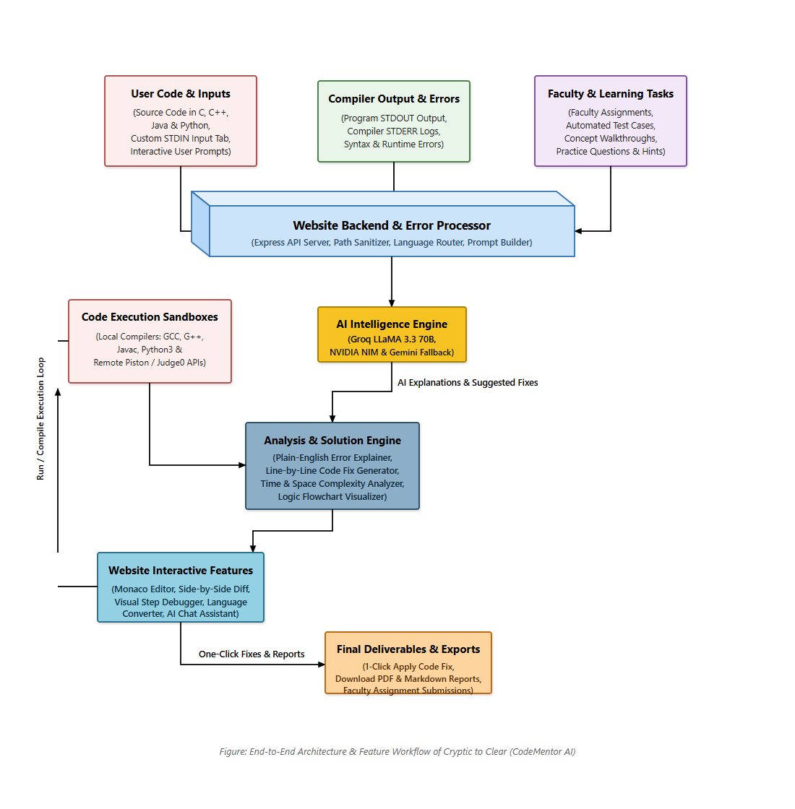
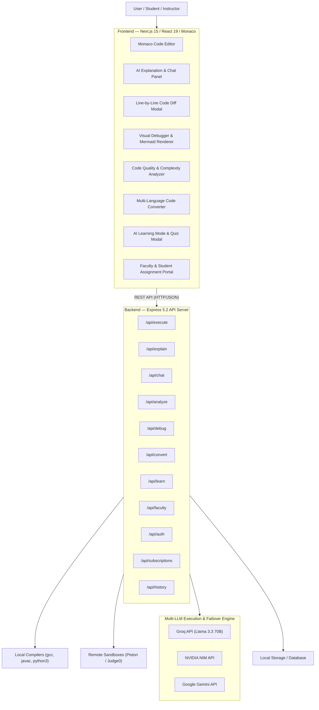

# Cryptic to Clear: A tiny compiler that explains its own errors

Cryptic to Clear is an intelligent compiler platform powered by AI that runs, compiles, analyzes, and explains code errors in plain English.

## Groq Setup

1. Get a Groq API key from [Groq Console](https://console.groq.com/).
2. In `backend/.env`, set your Groq API key:

```env
GROQ_API_KEY=gsk_your_groq_api_key_here
GROQ_MODEL=llama-3.3-70b-versatile
GROQ_BASE_URL=https://api.groq.com/openai/v1
```

3. Start the backend:

```bash
cd backend
npm install
npm start
```

---

## Modular Intelligence & Execution Layer

Provider-agnostic architecture separates AI orchestration from physical code execution:

| Capability | Supported Swappable Providers |
|------------|--------------------------------|
| **LLM Inference Engine** | Groq API (`llama-3.3-70b-versatile`), NVIDIA NIM (`meta/llama-3.3-70b-instruct`), Google Gemini API |
| **Local Compilers** | `gcc` / `g++` (C/C++), `javac` / `java` (Java), `python3` (Python), `node` (JavaScript), `go` (Go), `rustc` (Rust) |
| **Remote Sandboxes** | Piston API, Judge0 API (automatic fallback when local tools are unavailable) |
| **Code Editor** | Monaco Editor (`@monaco-editor/react`) with syntax highlighting & auto-formatting |
| **Visualizations** | Mermaid.js (flowcharts & logic graphs), React Syntax Highlighter, Diff Modal |
| **Export Engines** | `jsPDF` (custom PDF generation), Markdown download parser |

---

## Intelligent Routing & Failover

1. **Local CLI Execution First**: Code execution defaults to lightweight local temporary directories (`backend/tmp/exec-*`) with process timeout safeguards and auto-cleanup sweeps.
2. **Remote Sandbox Fallback**: If local compilers are missing or restricted, execution seamlessly fails over to remote Piston/Judge0 execution endpoints.
3. **Multi-LLM Provider Failover**: Primary AI requests use Groq's high-speed Llama 3.3 70B inference engine; rate-limits or API key exhaustion automatically trigger key rotation or fallback to NVIDIA NIM / Gemini.

---

## System Architecture

<div align="center">



*Figure: End-to-End System Architecture & Data Pipeline of Cryptic to Clear (CodeMentor AI)*
*(High-res SVG and 300 DPI exports available in [`docs/architecture/`](./docs/architecture/))*

</div>



---

## Backend API Endpoints

| Route | Method | Description |
|-------|--------|-------------|
| `/api/execute` | `POST` | Executes code locally or via remote API sandbox. |
| `/api/explain` | `POST` | Generates plain-English error explanation, root cause, and code diff. |
| `/api/chat` | `POST` | Stateful-aware contextual AI chat companion over source code. |
| `/api/analyze` | `POST` | Audits code quality, performance bottlenecks, and time/space complexity. |
| `/api/debug/trace` | `POST` | Generates step-by-step visual debug state traces. |
| `/api/convert` | `POST` | Converts source code from one programming language to another. |
| `/api/learn` | `POST` | Generates conceptual learning walkthroughs and multiple-choice quizzes. |
| `/api/faculty/*` | `GET`/`POST` | Faculty course management, assignment publishing, and student grading. |
| `/api/auth/*` | `POST` | User registration, login, JWT authentication, and session check. |
| `/api/subscriptions/*` | `GET`/`POST` | Subscription plans, status check, checkout session, and webhooks. |

---

## Local Setup

### Prerequisites
- **Node.js**: v18.0.0 or higher
- **Package Manager**: `npm`
- **Compiler Binaries (Optional for local execution)**: `gcc`, `g++`, `javac`, `python3` (or rely on remote sandbox fallback)
- **API Key**: Groq API Key (or NVIDIA / Gemini key)

### Installation & Launch

```powershell
# 1. Clone Repository
git clone https://github.com/svkatreddy/CodeMentor-AI.git
cd "Cryptic to Clear"

# 2. Backend Setup
cd backend
npm install
npm start
```

4. Verify backend health endpoint:

```bash
curl http://127.0.0.1:5000/api/health
```

---

codementor
